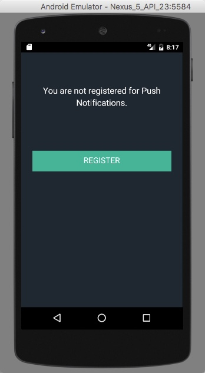

# Bluemix Push Notifications - Hands-On Exercise

## Introduction
In this hands-on exercise, you will configure Bluemix Push Notifications to send notifications to an Android device or emulator.  By doing so, you will see how easy it is to configure the services and incorporate them into a mobile app you are building.  We will be using a Cordova app, which uses HTML, CSS, and JavaScript, to create a cross-plaform app that will run on Android or iOS.  However for this exercise we will test and configure only for Android, but if you wish you may extend further to work on iOS.  You can also use this same Bluemix service to send notifications to browsers if you wish.

For more background on push notifications, and how the Bluemix push service enables them for mobile and web, check out [About Push Notifications](https://console.ng.bluemix.net/docs/services/mobilepush/c_overview_push.html#overview_push_process) in the Bluemix docs.

This exercise is based on the following Bluemix docs, linked here for your reference.

[HelloPush Cordova application for IBM MobileFirst Services on IBM Bluemix](https://github.com/ibm-bluemix-mobile-services/bms-samples-cordova-hellopush)
[IBM Bluemix Mobile Services - Cordova Plugin Push SDK](https://github.com/ibm-bluemix-mobile-services/bms-clientsdk-cordova-plugin-push/#configuration)  
[Enabling Cordova applications to receive push notifications](https://console.ng.bluemix.net/docs/services/mobilepush/c_cordova_enable.html)  
[Configuring credentials for Firebase Cloud Messaging](https://console.ng.bluemix.net/docs/services/mobilepush/t_push_provider_android.html)  

### System Requirements / Initial Setup

You need an Android development environment and Apache Cordova set up on your laptop to complete this exercise.  Here are the steps to set this up if you don't already have such an environment installed.

1. Install the requirements for Android app development using the instructions on the [Cordova website](http://cordova.apache.org/docs/en/latest/guide/platforms/android/index.html#installing-the-requirements).  Follow steps for *Installing the Requirements* and *Setting up an Emulator*.  Make sure to set up an emulator with Google Play services, which is required to receive push notifications.
1. Install the Git command-line tool. For Windows, make sure you select the **Run Git from the Window Command Prompt** option. For information about how to download and install this tool, see [Git ](https://git-scm.com/downloads).
1. Install the Node.js and Node Package Manager (NPM) tool. The NPM command-line tool is bundled with Node.js. For information about how to download and install Node.js, see [Node.js ](https://nodejs.org/en/download/).
1. From the command line, install the Cordova command-line tools by using the **npm install -g cordova** command. This is required to use the Cordova push plug-in. For information about how to install Cordova and set up your Cordova app, see [Cordova Apache ](https://cordova.apache.org/#getstarted). For more information, see the Cordova push plug-in [Readme file ](https://github.com/ibm-bluemix-mobile-services/bms-clientsdk-cordova-plugin-push).


### Create Push Notifications Instance

1. Log into Bluemix with your account credentials.
2. Click on Catalog and in the search box enter *push*.  You will see the Push Notifications service appear.  Click on this.
3. Check out the details of the service if you wish and then click the **Create** button.
4. You will see a welcome page where you can read some more about the service.  Your Push service has been created but has not been configured yet.  We will come back to this soon.

### Create Firebase project for Google Android notifications

We will configure a Firebase project on the Google website, since this is required by Google to send notifications to Android devices/apps.  A similar configuration is performed for iOS devices/apps on the Apple website.

1. Open another browser tab and go to [https://console.firebase.google.com](https://console.firebase.google.com) and log in with your Google ID.
2. Click the button to **Create New Project**.
3. Enter a project name as shown and click **Create Project**.

4. Once the project is created, click the gear at upper right and click *Project settings*.  

5. Click the *Cloud Messaging* tab at top.  You will see the Legacy Server key and Sender ID here.  Copy these down for a future step.

6. Click on Overview at upper left and then click **Add Firebase to your Android app**.  Enter a package name and app nickname as shown.  For your package name, a reverse naming scheme (such as com.ibm) with your app name last often works.  Click **Add App**.

7. In the next screen you will be prompted to download the *google-services.json* file which you will include in your app later.  For now download and save it onto your computer.


### Configure Push Notifications Instance

1. Return to your Bluemix browser tab, which should still be open to your Push Notifications instance.  Click on *Manage* and then click the **Configure Now** button.
2. In GCM/FCM Push Credentials, enter the Sender ID from the last section (step 5) for Sender ID/Project Number, and enter the Legacy Server key for API Key.  Click **Save**.
3. Your instance is now configured to talk to Firebase Cloud Messaging so Bluemix can tell Google to send notifications to your Android device and app.  Keep the browser tab open as we will come back to it later.

### Set up Android App

Now we can pull down the sample application we will use for the exercise and configure it to work with the Bluemix Push Notifications service.

#### Download the sample

Clone the samples with the following command:

```Bash
git clone https://github.com/ibm-bluemix-mobile-services/bms-samples-cordova-hellopush
```

#### Add the native platforms to your app

```Bash
cordova platform add android
```

#### Add the plugin

```Bash
cordova plugin add bms-push
```

### Configure the sample for your Push Notifications instance

1. Navigate to the directory where the project was cloned.
2. Open <b>index.js</b> located at [your-directory]/bms-samples-cordova-hellopush/www/js/index.js in a text editor.
3. Reopen the browser tab with Bluemix and your Push Notifications service.  Click on *Service Credentials* at the top, you should see one service credential in the list.
4. Click View Credentials and note the values for *appGuid* and *clientSecret*.  Copy these values down and paste them into your index.js file where indicated below.  Save and close the file once you've made the edits.


JavaScript:

```Javascript
// deviceready Event Handler
//
// Replace the appGuid and clientSecret with your own values
// These can be retrieved from your Push Notifications service instance
// Set the region: BMSClient.REGION_US_SOUTH, BMSClient.REGION_UK, or BMSClient.REGION_SYDNEY
onDeviceReady: function() {
		var appGuid = "MY APP GUID";
		var clientSecret = "MY CLIENT SECRET";

		BMSClient.initialize(BMSClient.REGION_US_SOUTH);

 		// iOS Actionable notification options. Eg : {"category_Name":[{"identifier_name_1":"action_Name_1"},{"identifier_name_2":"action_Name_2"}]}
		// Pass empty for Android
		var category = {};
		BMSPush.initialize(appGuid, clientSecret, category);
},
```

### Configure the app for Android build

1. Open the **config.xml** file located at [your-directory]/bms-samples-cordova-hellopush/config.xml in a text editor.  Change the text within the quotes **"com.ibm.test.1"** to the package you chose for the Android app in the Firebase project section (such as **"com.ibm.nextbigthing"** in my example screenshot).
2. You will now need the file you created in the Firebase project section previously, called **google-services.json**.  Copy this file into [your-directory]/bms-samples-cordova-hellopush/platforms/android.
3. Open the file named **build.gradle** in [your-directory]/bms-samples-cordova-hellopush/platforms/android directory.
4. Within **build.gradle** locate a section for *buildscript* then a subsection for *dependencies* where there is a single classpath entry.  Add a second classpath entry with the following text
```
classpath 'com.google.gms:google-services:3.0.0'
```

5. Scroll to the end of the **build.gradle** file and add the following entry:
```
apply plugin: 'com.google.gms.google-services'
```
6. Save and close the **build.gradle** file as we are done with the build configuration steps for Android.

### Build and Run the Cordova App on Android

Now you can run your application in your mobile emulator or on your Android device.

1. Build the Cordova app. From your terminal enter the following command:

	```Bash
  cordova prepare android
  cordova build android
	```

2. Run the sample app. From your terminal enter the following command:

	```Bash
	cordova run android
	```

### Test Android App on Device or emulator

1. You should see the application launch on your device or emulator and a screen as shown.  Click the **Register** button as this will register the device for push notifications with the Bluemix Push Notifications service.

2. You should see a screen where it shows that you have successfully registered for push notifications.

3. Now that the device has registered for push, let's send it a notification.  Go back to the browser tab where Bluemix is open with your Push Notification instance, and click on *Manage* and then *Send Notifications*.  Enter in a message into the message box and then click the **Send** button.
4. Huzzah!  Successful push notification received!
  
The mobile application received this message via its callback method.

### Conclusion / Further Exploration

This has been a quick introduction to using the Push Notifications service on Bluemix.  You can go much further with this service by configuring notifications for iOS as well as web browsers.  You can configure the notification tags so that apps can subscribe to them as notification topics.  You will also want to further explore the API's you can use within the Cordova plugin for Bluemix Push or within the native plugins for iOS or Android for native development.  Finally, you can experiment with [OpenWhisk](https://console.ng.bluemix.net/openwhisk), which is an innovative open-source "serverless" compute platform within Bluemix.  You can use OpenWhisk and Push Notifications together to link events and actions to make sophisticated flows easily.

Thank you and I hope you enjoyed our session!

[https://github.com/gregackerman/bluemix-mobile-push-hands-on](https://github.com/gregackerman/bluemix-mobile-push-hands-on)  
Greg Ackerman, IBM, gpacker@us.ibm.com
